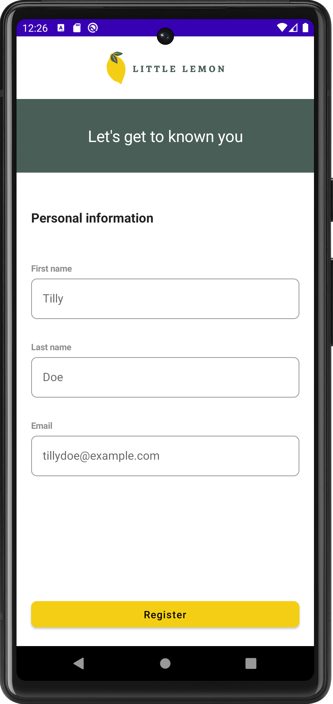
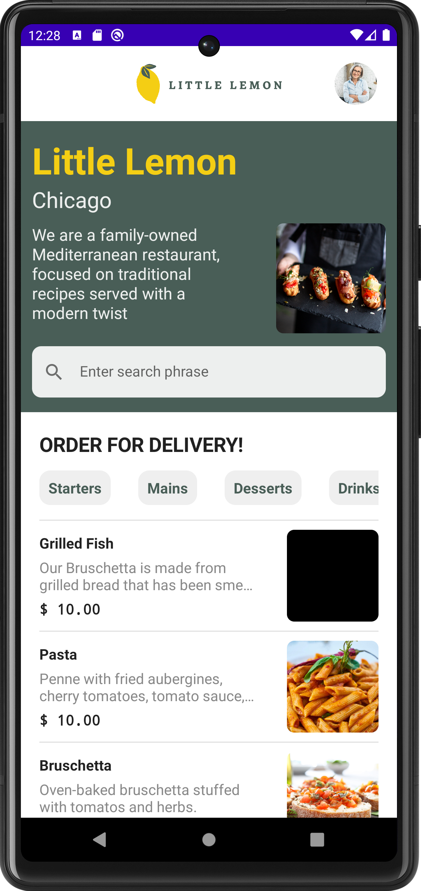
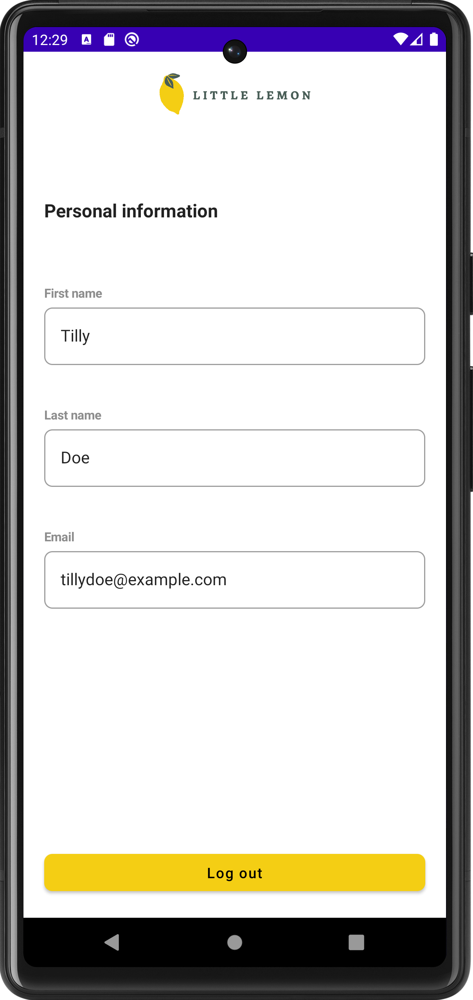

## Android Capstone Project

    

## Screenshots

    
    
    

## Meta Android Developer Professional Certificate from Coursera

    

- Credential ID: 23ZUJXEGZ7KR
- Credential URL: https://www.coursera.org/account/accomplishments/specialization/certificate/23ZUJXEGZ7KR
